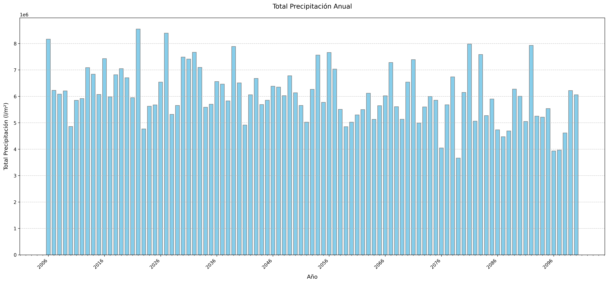
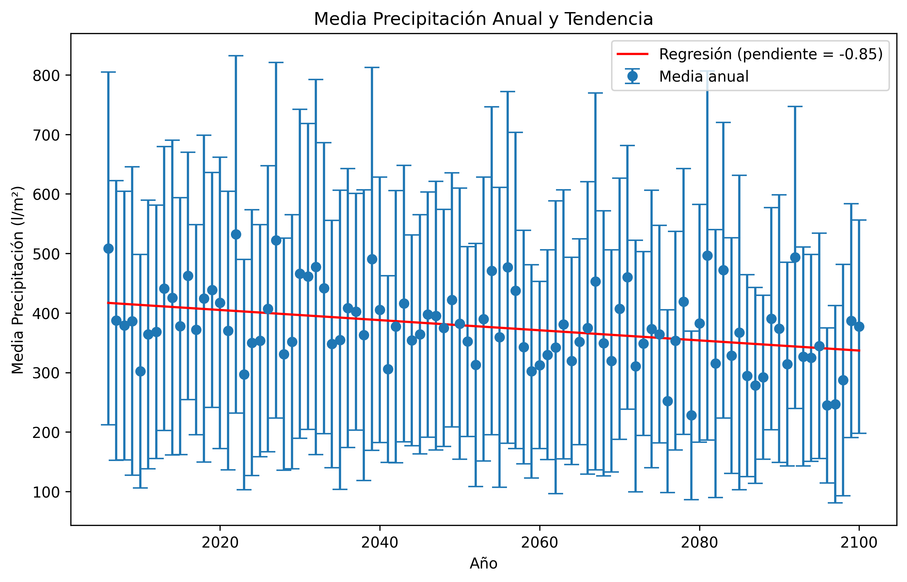
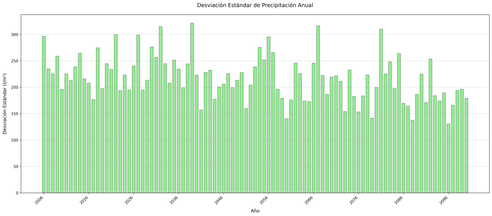
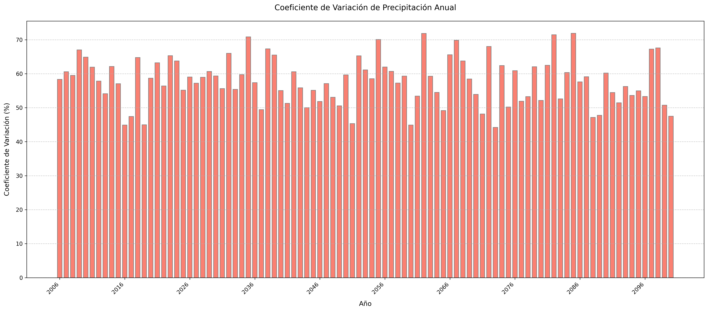
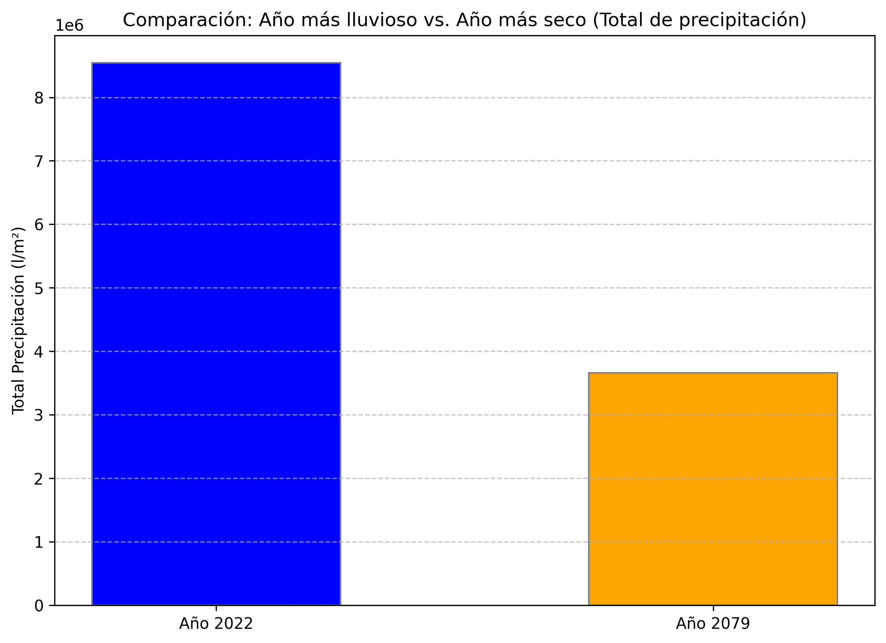

# Script de Validación de Datos

Script para validar archivos de datos y asegurarse que cumplen con el formato esperado y si los datos son correctos.

## 1 Validació format arxius i capçaleres

### 1.1 Configuración de Logging
Configurar un registro de errores que guarda los mensajes de error en el archivo `error_log.log`, utilizando la función logging facilitamos el trabajo.
Esta configuración incluye:
- Fecha y hora del error.
- Nombre del archivo y línea específica donde ocurrió el problema.
- Descripción detallada del error.
  
### 1.2 Función `revisar_format`
Creamos una función que verifica si el archivo tiene la extensión `.dat`, para eso utilizamos el *endswith*, que mira solo el final del nombre, ignorando el resto.

### 1.3 Función `llegir_fitxer`
Lee un archivo y detecta el delimitador utilizado en el archivo.
- Primero abrimos el archivo en modo lectura.
- Leemos las primeras 10 líneas del archivo para identificar el delimitador.
  - Si no se encuentra un delimitador, se asume que es un espacio.
  - Si se encuentra un delimitador, se guarda en la variable `delimitador`.

### 1.4 Función `hi_ha_comentaris`
Comprueba si el archivo contiene comentarios que empiezan con `#`, para eso utilizamos el *startswith*.
- Si encuentra un comentario, lo ignora y sigue leyendo el archivo.
- Si no encuentra un comentario, sigue leyendo el archivo.
- Si encuentra un comentario después de haber leído los datos, se detiene la lectura.

### 1.5 Función `revisar_capcaleres`
Válida que la primera fila de encabezado sea idéntica en todos los archivos y que la segunda fila tenga el formato correcto.
- Para esto, primero leemos las primeras dos líneas del archivo.
- Luego, comparamos la primera fila de encabezado con la primera fila de encabezado de los otros archivos.
- Comparamos la segunda fila de encabezado con el formato esperado.
- Si no se cumple alguna de las condiciones, se muestra un mensaje de error.
- Si se cumple, se muestra un mensaje de éxito.

### 1.6 Función `processar_fitxers`
Procesa todos los archivos `.dat` en el directorio especificado:
- Lee los archivos.
- Verifica la extensión del archivo.
- Detecta el delimitador (coma, tabulación o espacio).
- Revisa si hay comentarios.
- Comprueba que los encabezados sean consistentes.

---

## 2 Validació de dades

### 2.1 Función `es_numero`
Verifica si un valor dado es un número. Esto lo logra intentando pasar un número a `float`. Si lo logra, significa que es un número; de lo contrario, es cualquier otro tipo de carácter.
Esta es la parte mas importante ya que con esto sabemos si el valor tiene el formato correcto.

### 2.2 Función `tiene_decimales`
Verifica si un valor contiene decimales:
- Reemplaza comas por puntos para realizar la validación.
- Compara el número con su versión entera. Si son diferentes, tiene decimales.

### 2.3 Función `validar_archivo`
Valida un archivo de datos, verificando:

1. **Estructura del Archivo**:
   - Comprueba que el archivo tenga al menos tres líneas (dos del encabezados y al menos una de datos).
   - Si no se cumple, registra un error.

2. **Detección del Delimitador**:
   - Busca tabuladores o espacios como delimitador.
   - Si no encuentra ninguno, el archivo es inválido.

3. **Validación de Datos**:
   - Asegura consistencia en el número de columnas.
   - Valida que las columnas contengan números válidos incluso comprueba si el PX tiene el mismo numero en cada fila.
   - Registra errores por valores vacíos o no numéricos.

4. **Validación Anual**:
   - Verifica que haya exactamente 12 meses de datos por año.
   - Si el ciclo no es completo, registra un error.

### 2.4 Función `validar_archivos_en_carpeta`
Lee todos los archivos de la carpeta que son `.dat`. 
Si no ha pasado alguna de las pruebas de validación, el error sera redirigido a error_log.log indicando el archivo que contiene el error junto a la linea y columna.

- Llama a `validar_archivo` para realizar las comprobaciones.
- Registra un error general si el archivo contiene errores de formato.
- Registra errores específicos si los datos no son válidos.
- Muestra un mensaje de éxito si el archivo es válido.

---

## 3. Estadística y Resultados

Este script analiza archivos de datos meteorológicos en formato `.dat` para calcular estadísticas anuales de precipitación por estación meteorológica. Los datos se extraen de múltiples archivos, se procesan y se exportan a un archivo CSV, además de mostrar un resumen en pantalla.

### 3.1 Importación de Módulos
- `import os`: Importa el módulo `os` para interactuar con el sistema de archivos.
- `matplotlib.pyplot`: Visualiza el resultado.
- `import numpy as np`: Importa el módulo `numpy` como `np` para operaciones numéricas.

### 3.2 Función `calcular_estadisticas`
- `def calcular_estadisticas(directorio):`: Define la función `calcular_estadisticas` que toma como argumento la ruta del directorio que contiene los archivos de datos.
- `total_valores_procesados = 0`: Inicializa el contador de valores procesados.
- `valores_faltantes = 0`: Inicializa el contador de valores faltantes.
- `archivos_procesados = 0`: Inicializa el contador de archivos procesados.
- `lineas_procesadas = 0`: Inicializa el contador de líneas procesadas.
- `estadisticas_totales = pd.DataFrame()`: Inicializa un DataFrame vacío para almacenar las estadísticas.

### 3.3 Lectura y Procesamiento de Archivos
- `for archivo in os.listdir(directorio):`: Itera sobre cada archivo en el directorio.
- `ruta_archivo = os.path.join(directorio, archivo)`: Construye la ruta completa del archivo.
- `if os.path.isfile(ruta_archivo):`: Verifica si la ruta corresponde a un archivo.
- `for chunk in pd.read_csv(ruta_archivo, skiprows=2, sep=' ', header=None, usecols=[1] + list(range(3, 34)), names=['año'] + [f'dia_{i}' for i in range(1, 32)], dtype={'año': int, **{f'dia_{i}': float for i in range(1, 32)}}, chunksize=1000):`: Lee el archivo en chunks de 1000 filas, omitiendo las dos primeras líneas y especificando las columnas y tipos de datos.

### 3.4 Actualización de Contadores
- `archivos_procesados += 1`: Incrementa el contador de archivos procesados.
- `lineas_procesadas += len(chunk)`: Incrementa el contador de líneas procesadas.
- `total_valores_procesados += chunk.shape[0] * chunk.shape[1]`: Incrementa el contador de valores procesados.
- `valores_faltantes += (chunk == -999).sum().sum()`: Incrementa el contador de valores faltantes.

### 3.5 Procesamiento de Datos
- `chunk = chunk.melt(id_vars=['año'], var_name='dia', value_name='precipitacion')`: Transforma el DataFrame de formato ancho a largo.
- `chunk['precipitacion'].replace(-999, np.nan, inplace=True)`: Reemplaza los valores -999 por NaN.

### 3.6 Cálculo de Estadísticas
- `estadisticas = chunk.groupby('año')['precipitacion'].agg(total_mm=lambda x: x.sum(), total_m=lambda x: x.sum() / 1000, media_mm=lambda x: x.mean(), media_m=lambda x: x.mean() / 1000, desviacion_estandar_mm=lambda x: x.std(), desviacion_estandar_m=lambda x: x.std() / 1000, coeficiente_variacion=lambda x: x.std() / x.mean())`: Calcula las estadísticas anuales.
- `estadisticas_totales = pd.concat([estadisticas_totales, estadisticas])`: Concatena las estadísticas calculadas al DataFrame total.

### 3.7 Cálculo de Tendencia de Cambio Anual
- `estadisticas_totales = estadisticas_totales.groupby(estadisticas_totales.index).mean()`: Agrupa y promedia las estadísticas por año.
- `tendencia_cambio = estadisticas_totales['total_mm'].diff()`: Calcula la diferencia anual en la precipitación total.
- `anyo_mas_pluvioso = estadisticas_totales['total_mm'].idxmax()`: Encuentra el año con mayor precipitación.
- `anyo_mas_seco = estadisticas_totales['total_mm'].idxmin()`: Encuentra el año con menor precipitación.

### 3.8 Mostrar Resultados
- `print(f"Total de datos faltantes: {valores_faltantes}")`: Imprime el total de datos faltantes.
- `print(f"Total de datos: {total_valores_procesados}")`: Imprime el total de datos procesados.
- `print(f"Porcentaje de datos faltantes: {(valores_faltantes / total_valores_procesados) * 100:.2f}%")`: Imprime el porcentaje de datos faltantes.
- `print("Estadísticas anuales:")`: Imprime el encabezado de estadísticas anuales.
- `for anyo, stats in estadisticas_totales.iterrows():`: Itera sobre cada año y sus estadísticas.
- `print(f"Año {anyo}: Total = {stats['total_mm']} mm ({stats['total_m']} m), Media = {stats['media_mm']:.2f} mm ({stats['media_m']:.2f} m), Desviación Estándar = {stats['desviacion_estandar_mm']:.2f} mm ({stats['desviacion_estandar_m']:.2f} m), Coeficiente de Variación = {stats['coeficiente_variacion']:.2f}")`: Imprime las estadísticas de cada año.
- `print("Tendencia de cambio anual:")`: Imprime el encabezado de tendencia de cambio anual.
- `for anyo, cambio in tendencia_cambio.items():`: Itera sobre cada año y su cambio en precipitación.
- `print(f"Año {anyo}: Cambio = {cambio} mm")`: Imprime el cambio en precipitación de cada año.
- `print(f"Año más pluvioso: {anyo_mas_pluvioso} con {estadisticas_totales.loc[anyo_mas_pluvioso, 'total_mm']} mm ({estadisticas_totales.loc[anyo_mas_pluvioso, 'total_m']} m)")`: Imprime el año más pluvioso.
- `print(f"Año más seco: {anyo_mas_seco} con {estadisticas_totales.loc[anyo_mas_seco, 'total_mm']} mm ({estadisticas_totales.loc[anyo_mas_seco, 'total_m']} m)")`: Imprime el año más seco.

### 3.9 Manejo de Errores
- `except FileNotFoundError as e: print(f"Error: {e}")`: Maneja errores de archivo no encontrado.
- `except pd.errors.EmptyDataError as e: print(f"Error: {e}")`: Maneja errores de datos vacíos.
- `except Exception as e: print(f"An unexpected error occurred: {e}")`: Maneja otros errores inesperados.

### 10. Ejemplo de Uso
- `calcular_estadisticas('precip.MIROC5.RCP60.2006-2100.SDSM_REJ')`: Llama a la función `calcular_estadisticas` con la ruta del directorio que contiene los archivos de datos.

---

### 3.10 Generación y Exportación de Gráficos Estadísticos

Este apartado describe cómo se generan y exportan los gráficos estadísticos en formato PNG.

#### Gráfico 1: Totales Anuales de Precipitación
- Se crea un gráfico de barras que muestra el total de precipitación anual.
- Se ajustan las etiquetas del eje X para mostrar los años de manera legible.
- Se guarda el gráfico en alta resolución.

#### Gráfico 2: Media Anual con Barras de Error y Línea de Tendencia
- Se crea un gráfico de puntos con barras de error que muestra la media anual de precipitación y su desviación estándar.
- Se añade una línea de tendencia calculada mediante regresión lineal.
- Se guarda el gráfico en alta resolución.

#### Gráfico 3: Desviación Estándar Anual
- Se crea un gráfico de barras que muestra la desviación estándar anual de la precipitación.
- Se ajustan las etiquetas del eje X para mostrar los años de manera legible.
- Se guarda el gráfico en alta resolución.

#### Gráfico 4: Coeficiente de Variación Anual
- Se crea un gráfico de barras que muestra el coeficiente de variación anual de la precipitación.
- Se ajustan las etiquetas del eje X para mostrar los años de manera legible.
- Se guarda el gráfico en alta resolución.

#### Gráfico 5: Comparación entre el Año más Lluvioso y el Año más Seco
- Se crea un gráfico de barras que compara el total de precipitación entre el año más lluvioso y el año más seco.
- Se guarda el gráfico en alta resolución.

Los gráficos se exportan a la carpeta `../E03` con nombres descriptivos.

---

### 4. Página Web de Resultados Estadísticos

Esta página web presenta datos climatológicos en formato CSV y muestra gráficos estadísticos relacionados con precipitaciones anuales.

### 4.1 Visualización del Archivo CSV

La página permite visualizar un archivo CSV que contiene datos climatológicos anuales.

#### Funcionalidad:
- Se proporciona un enlace para alternar la visualización del CSV.
- Al hacer clic en "Ver CSV", se carga el contenido del archivo `estadisticos_anuales.csv`.
- Los datos se muestran en una tabla HTML generada dinámicamente.
- Si se vuelve a hacer clic, la tabla se oculta.

### 4.2. Visualización de Gráficos Estadísticos

La página muestra imágenes que representan diferentes estadísticas sobre la precipitación anual ya mencionados anteriormente.

### 4.3 Estructura de Archivos

La página se compone de los siguientes archivos y carpetas:

E04/Web/ ├── styles.css # Estilos CSS de la página E03/ ├── estadisticos_anuales.csv # Archivo CSV con datos ├── coeficiente_variacion_anual.png ├── comparacion_lluvioso_seco.png ├── desviacion_estandar_anual.png ├── media_precipitacion_anual.png ├── total_precipitacion_anual.png

### 5. Resumen de Funcionamiento

1. La página carga y muestra un título y una sección de "Resúmenes Estadísticos".
2. Un enlace permite alternar la visualización de los datos CSV en una tabla.
3. Se muestran imágenes con estadísticas de precipitación anual.
4. Los estilos y scripts están organizados en archivos externos.

Esta estructura permite visualizar de manera sencilla los datos climáticos y su análisis gráfico.

---
---

## Ejecución del programa
Se ejecuta llamando el archivo main.py que llama a las funciones de validación y estadísticas.
